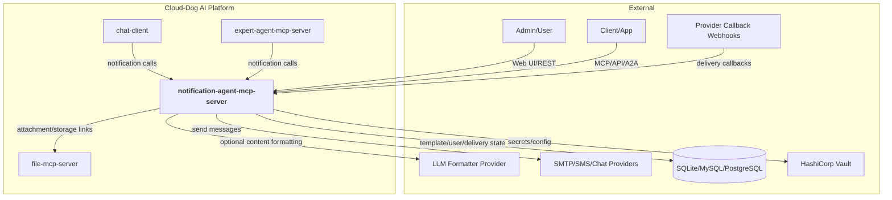
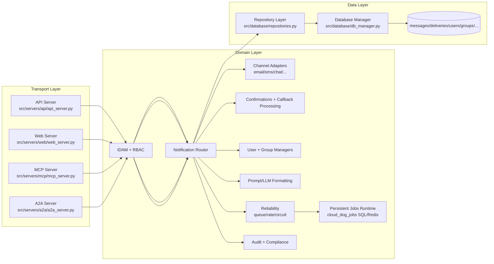
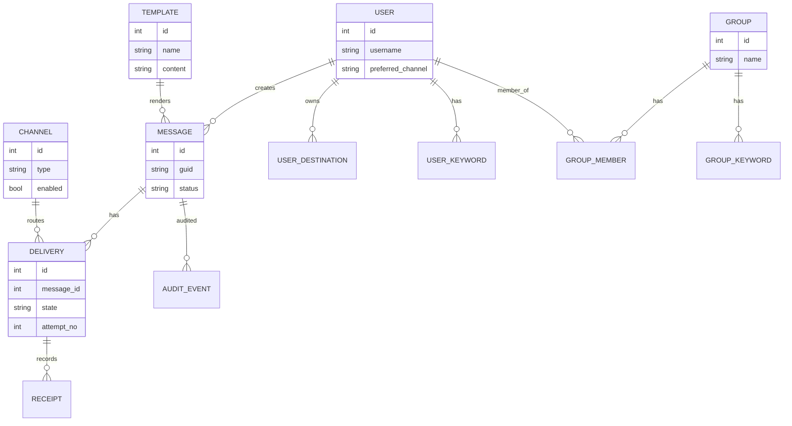
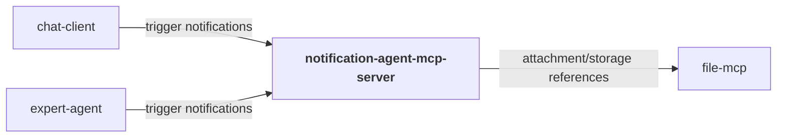
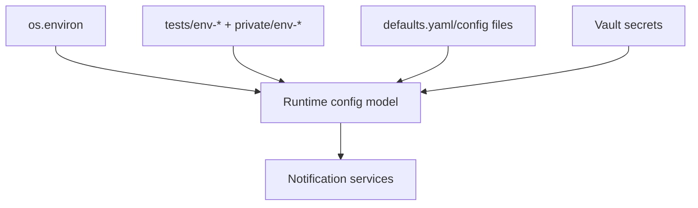
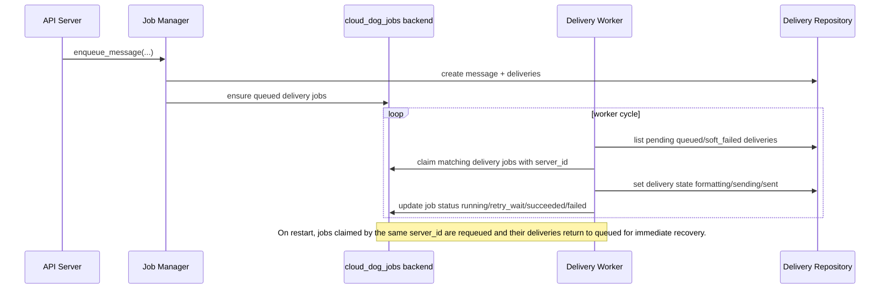
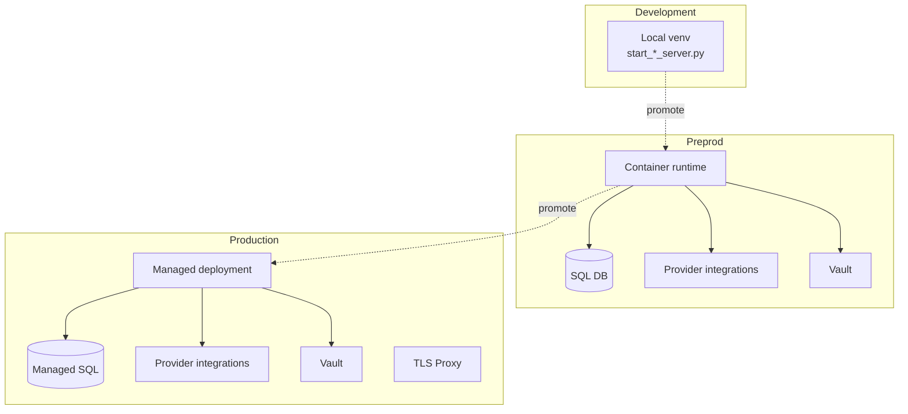
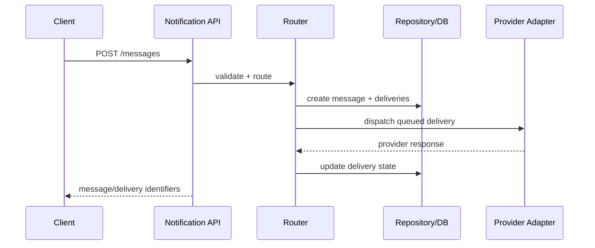
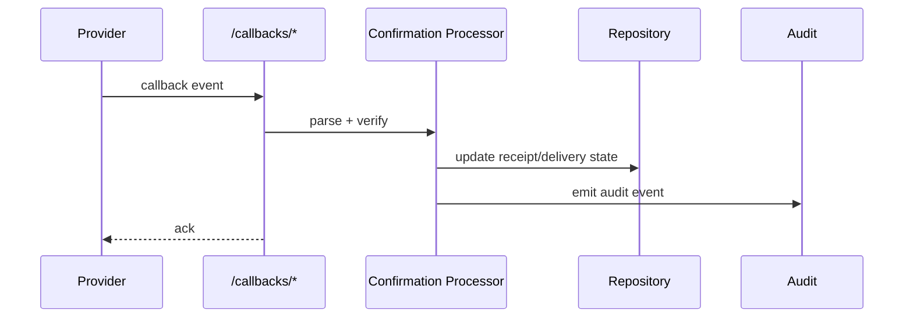

# Notification Agent MCP Server — Architecture

## W28A-421 Review Status
- Reviewed for external/shareable publication during W28A-421.
- Source basis: `defaults.yaml`, 12 server source files, 226 discovered routes/endpoints, and 12 MCP tools.
- Internal-only absolute paths, environment-specific hosts, and private registries have been removed from this shareable document set.

## 1. Overview
`notification-agent-mcp-server` is a multi-channel notification orchestration service with REST API, Web UI, MCP, and A2A interfaces. It manages message creation, channel delivery, callbacks, retries, user/group targeting, and compliance/audit workflows.

The service is stateful and queue-oriented: messages and deliveries are persisted, processed through channel adapters, and tracked through lifecycle states (`queued`, `sent`, `delivered`, `read`, `failed`, `soft_failed`).

Within Cloud-Dog AI, it serves as the platform notification backend for other agent services and interactive clients.

## 2. System Context Diagram

The service bridges internal message intents to external delivery providers while preserving full auditability and policy controls.

## 3. Component Architecture

All interfaces drive the same routing and repository core, so delivery state and policy are consistent regardless of entry transport.

## 4. Module Decomposition
| Module | Path | Responsibility | Platform Package |
|---|---|---|---|
| API server | `src/servers/api/api_server.py` | Core REST endpoints for messages, deliveries, users, groups, channels | `fastapi` |
| Web server | `src/servers/web/web_server.py` | Admin UI and API proxy views | `fastapi` |
| MCP server | `src/servers/mcp/mcp_server.py` | MCP tool catalogue and tool execution | `mcp` |
| A2A server | `src/servers/a2a/a2a_server.py` | A2A health and natural-notification endpoint | `fastapi` |
| Channel adapters | `src/adapters/*`, `src/core/adapters/*` | Provider-specific delivery integrations | — |
| Confirmation processor | `src/core/confirmations/*` | Callback ingestion and delivery-state updates | — |
| User/group domain | `src/core/users/*`, `src/core/groups/*` | Targeting and recipient policy | — |
| Compliance/audit | `src/core/compliance/*`, `src/core/audit/*` | Redaction, signature, audit persistence | `cloud_dog_logging` patterns |
| Config runtime | `src/config/*` | Runtime config loading and coercion | `cloud_dog_config` patterns |
| Jobs runtime | `src/core/jobs/runtime.py` | Persistent delivery job backend selection, claims, retry state | `cloud_dog_jobs` |
| Persistence | `src/database/db_manager.py`, `src/database/repositories.py` | SQL runtime and repository layer | `cloud_dog_db` integration |

## 5. Data Model

The persistent schema is repository-managed with migration scripts for SQLite/MySQL/Postgres under `database/migrations/`.

## 6. Interface Specifications
### 6.1 REST API
| Method | Path | Description | Auth |
|---|---|---|---|
| GET | `/health` | Service health | None |
| GET | `/ready` / `/live` | Readiness/liveness | None |
| POST | `/messages` | Create notification message | API key |
| GET | `/messages` | List messages | API key |
| GET | `/messages/{message_identifier}` | Message details | API key |
| POST | `/messages/{message_identifier}/cancel` | Cancel message processing | API key |
| GET | `/deliveries` | List deliveries | API key |
| POST | `/deliveries/{delivery_id}/resend` | Resend delivery | API key |
| POST | `/channels/{channel_id}/test` | Channel test send | API key |
| POST | `/callbacks/email|sms|whatsapp|chat` | Provider callbacks | Provider/API key |

### 6.2 MCP Tools
| Tool | Description | Category |
|---|---|---|
| `send_notification_tool` | Send message with structured payload | delivery |
| `send_notification_natural_tool` | Natural-language notification request | delivery |
| `get_message_status_tool` / `get_message_tool` | Message lookup/status | tracking |
| `list_messages_tool` | List messages | tracking |
| `list_channels_tool` | Channel catalogue | admin |
| `cancel_message_tool` | Cancel message | control |
| `list_deliveries_tool` | Delivery list | tracking |
| `resend_delivery_tool` / `abort_delivery_tool` | Delivery lifecycle controls | control |
| `get_status_tool` | Service status summary | ops |

### 6.3 A2A Endpoints
| Endpoint | Description | Protocol |
|---|---|---|
| `/health` (A2A app) | A2A server health | HTTP GET |
| `/notify/natural` | Natural-language notify action | HTTP POST |

## 7. Dependencies & External Services
### 7.1 Platform Packages
| Package | Version | Usage in this project |
|---|---|---|
| `cloud_dog_config` (runtime usage) | project-integrated | Config loading/runtime adapters |
| `cloud_dog_logging` (runtime usage) | project-integrated | Structured logs + audit support |
| `cloud_dog_idam` (runtime usage) | project-integrated | Auth and RBAC runtime |
| `cloud_dog_db` (runtime usage) | project-integrated | DB engine abstraction |
| `fastapi` / `mcp` | dependency | Transport layer implementation |

### 7.2 External Services
| Service | Purpose | Connection | Vault Path |
|---|---|---|---|
| SQL database | Message/delivery/user/group persistence | `db.*` / URI | `dev.databases.*` |
| SMTP/SMS/chat providers | Delivery execution | channel adapter config | `dev.notifications.*` |
| LLM provider | Content formatting/generation | `llm.*` | `dev.models.*` |
| Vault | Secrets/config | env + vault client | `secret/*` |

### 7.3 Cross-Project Dependencies

## 8. Configuration Architecture

Important config sections include `api_server`, `web_server`, `mcp_server`, `a2a_server`, `channels`, `queue`, `rate_limit`, `circuit`, `auth`, `retention`, and `storage`.

`queue.backend` defaults to `sql`, using the same SQL database URL as the service unless `queue.sql_database_url` overrides it. `queue.backend=redis` is supported through `queue.redis_url` and `queue.redis_key_prefix`. `app.server_id` is injected into all log records and is also used by the jobs runtime to claim work and recover this server's in-flight jobs after restart.

## 8.1 Persistent Delivery Job Flow

## 9. Security Architecture
- Authentication: API-key protected operational endpoints plus UI auth flows.
- Authorisation: role-aware endpoint restrictions and group/user policy checks.
- Secrets: provider credentials and DB secrets resolved through env/Vault mechanisms.
- Audit: event-level audit records and callback/change logging.
- Network: separate interface ports and callback endpoints with health/readiness checks.

## 10. Deployment Architecture

## 11. Key Flows
### 11.1 Message-to-Delivery Flow

### 11.2 Callback Reconciliation Flow

## 12. Non-Functional Characteristics
| Characteristic | Approach |
|---|---|
| Scalability | Queue-backed delivery processing and decoupled channel adapters |
| Reliability | Retry/soft-fail states, callback reconciliation, health/readiness probes |
| Observability | Structured logs, audit trails, status endpoints, and delivery traceability |
| Performance | Async endpoints and batched repository access patterns |
| Maintainability | Transport/domain/persistence split with explicit repository abstraction |
